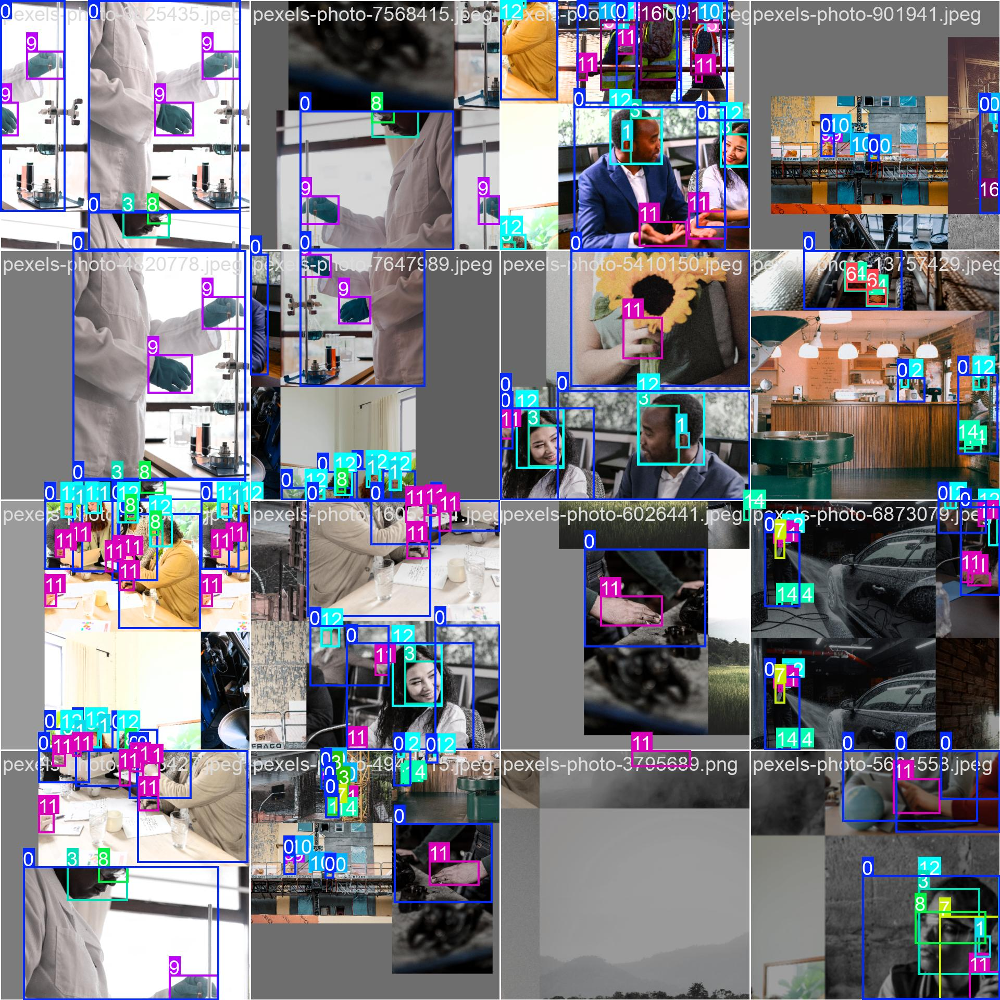

<a id="readme-top"></a>
<p align="center">
  
</p>

<h1 align="center">WorkSafe AI: Smart PPE Detection System</h1>

<p align="center">
 A deep learning-based web application for detecting Personal Protective Equipment (PPE) using the YOLOv8 object detection model. The system supports detection through photo uploads, video file processing, and real-time webcam feeds. It offers a user-friendly interface to monitor compliance, compute safety scores, and archive detection logs for future review.
</p>
</br>

<p align="center">
  
</p>
</br>


## Table of Contents

1. [Overview](#overview)  
2. [Key Features](#key-features)  
3. [Getting Started](#getting-started)  
   - [Prerequisites](#prerequisites)  
4. [Usage](#usage)  
5. [Technical Details](#technical-details)  
   - [Dependencies](#dependencies)  
   - [Dataset & Model](#dataset--model)
   - [Supporting Files](#supporting-files)  
   - [API Documentation](#api-documentation)  
6. [Folder Structure](#folder-structure)  
7. [License](#license)


<p align="right">(<a href="#readme-top">back to top</a>)</p>
<br>


## Overview

Smart PPE Detection System is an AI-powered real-time safety monitoring platform designed to detect personal protective equipment (PPE) usage in industrial environments. The system utilizes a YOLOv8-based object detection model to recognize and verify the presence of critical safety gear — including **helmets**, **safety vests**, **gloves**, **masks**, and more.

It features an intuitive Flask-based web interface where users can upload **photos**, **videos**, or use their **webcam** for live detection. Each detection is analyzed to compute a **safety score**, track compliance over time, and generate visual logs and statistics.

With this system, organizations can elevate their safety protocols and ensure that workers are complying with PPE standards in real time.

<p align="right">(<a href="#readme-top">back to top</a>)</p>
<br>


## Key Features

| **Functionality**             | **Details** |
|------------------------------|-------------|
| **Multi-Source Detection**    | Supports `photo`, `video`, and `live webcam` input for PPE detection. |
| **YOLOv8 Inference Engine**   | Uses pretrained `best.pt` with `yolodetection.py` for real-time object detection (17 PPE-related classes). |
| **Automated Safety Scoring**  | Calculates safety compliance scores based on critical equipment per scenario (e.g., Construction, Lab). |
| **Webcam & Video Handling**   | Uses OpenCV’s `VideoCapture` and `VideoWriter` to process media and export annotated videos. |
| **Visual Risk Analytics**     | Chart.js visualizations display detection stats, risk trends, and safety score distributions. |
| **Detection Log System**      | Logs each detection event and stores them in accessible tables and gallery pages. |
| **PDF & Excel Export Support**| Report generation with `fpdf2` and `openpyxl`, styled and formatted. |
| **Modern Web Interface**      | Responsive UI built with `Flask + Jinja2`, including animations and multilingual font rendering. |

<p align="right">(<a href="#readme-top">back to top</a>)</p>
<br>


## Getting Started

To set up and run the Smart PPE Detection System on your local machine, follow these simple steps.

- Ensure Python 3.10.0 or later is installed.  
- Make sure `pip` package manager is available.

<br>

### Prerequisites

- Download 7.1.1 version of FFmpeg from the [official site](https://www.gyan.dev/ffmpeg/builds/ffmpeg-release-essentials.zip). Extract the folder and add the full path to the `bin` directory to your system’s **environment variables > PATH**.

<p align="right">(<a href="#readme-top">back to top</a>)</p>
<br>


## Usage
After installing dependencies and configuring your environment:

1. **Clone the repository and install dependencies:**
   ```bash
   pip install -r requirements.txt
   ```

2. **Start the Flask app:**
   ```bash
   python flaskapp.py
   ```
3. **Stop the server at any time, press:**
   ```bash
   CTRL+C
   ```

<br>

Visit http://127.0.0.1:5000 in your browser to access the web interface:
<br>
<p align="center">
  
</p>
   
<p align="right">(<a href="#readme-top">back to top</a>)</p>
<br>


## Technical Details

### Dependencies

The following Python libraries power the system's detection, visualization, and export capabilities:

- [![Flask][Flask]][Flask-url]

- [![OpenCV][OpenCV]][OpenCV-url]

- [![Pandas][Pandas]][Pandas-url]

- [![Ultralytics][Ultralytics]][Ultralytics-url]

- [![fpdf2][fpdf2]][fpdf2-url]

- [![openpyxl][openpyxl]][openpyxl-url]

<br>

> Tested on Python 3.10.0 with Ultralytics YOLOv8 v8.3.55 and Flask v3.1.0.

<p align="right">(<a href="#readme-top">back to top</a>)</p>
<br>


### Dataset & Model

The dataset used in this project is the SH17 Dataset for PPE Detection, available on [Kaggle](https://www.kaggle.com/datasets/mugheesahmad/sh17-dataset-for-ppe-detection). It contains 8,099 images, each accompanied by a corresponding YOLO-format .txt annotation file.

The dataset defines 17 classes, covering various PPE items and human body parts:
```
['person', 'ear', 'ear-mufs', 'face', 'face-guard', 'face-mask', 'foot', 'tool', 
 'glasses', 'gloves', 'helmet', 'hands', 'head', 'medical-suit', 
 'shoes', 'safety-suit', 'safety-vest']
```
<br>

- **Model Training:**

  - YOLOv8n (Nano) - provided by [Ultralytics](https://github.com/ultralytics/ultralytics). The best model (`best.pt`) was exported and integrated into the Flask web app.

<br>
<p align="center">
  
</p>
<br>

- **Training Environment:**
  - Platform: Kaggle Notebooks (Cloud-based)
  - GPU: NVIDIA Tesla T4 ×2
  - Framework: Ultralytics YOLOv8 (built on PyTorch)

<br>

- **Training Parameters:**
  - Epochs: 50
  - Image Size: 640x640
  - Batch Size: 16

<br>

- **Label Distribution and Bounding Box Statistics:**
  - The top-left bar chart shows the distribution of object instances across the 17 PPE-related classes.
  - The bounding box overlay heatmaps visualize box center locations and size dispersions.
  - The majority of annotations are centered within the frame, with frequent instances of helmets, gloves, and personnel-related labels dominating the distribution.

<br>
<p align="center">
  
</p>
<br>

- **Sample Training Batches:**
  - These training batch visualizations confirm the diversity and annotation quality of the dataset.
  - YOLOv8's built-in augmentation (mosaic, flipping, color shift) increases variability, improving generalization across scenarios.

<br>
<p align="center">
  
  
  
</p>
<br>

> These training insights were used to fine-tune the model for robust PPE detection in varied industrial and laboratory settings.

<p align="right">(<a href="#readme-top">back to top</a>)</p>
<br>


### Supporting Files

- **cleanup_static.bat:**  
  This batch script automatically deletes old media results from the `static/` directory (`video_results/`, `photo_results/`, and `thumbs/`) when the app exits.

- **cleanup_results.bat:**  
  This script clears log files and exported reports from the `results/` directory (e.g., `.txt`, `.xlsx`, `.pdf`) to ensure clean analysis on the next run.

- **DejaVu Fonts:** This project includes `DejaVuSans.ttf` to ensure clear, consistent, and multilingual text rendering, especially for charts and graphical outputs. Its wide Unicode coverage and modern appearance make it suitable for statistical displays in multiple languages.

- **OpenH264 Codec:** The file `openh264-1.8.0-win64.dll`, provided by Cisco, is included to support **H.264 video encoding and decoding**. This codec ensures smooth video generation and playback when using OpenCV's `VideoWriter` during detection output generation.

<br>

Note: The `results/` and `static/` directories are initially empty. They are automatically populated at runtime with log files, photo/video detection results, and generated exports (Excel/PDF). These folders are also automatically cleaned up when the app exits using `cleanup_*.bat` scripts.

<p align="right">(<a href="#readme-top">back to top</a>)</p>
<br>


### API Documentation

Smart PPE Detection System includes a Flask API that provides the following main endpoints:

| **Endpoint**             | **Method** | **Description**                                      |
|--------------------------|------------|------------------------------------------------------|
| `/`                      | GET        | Home page                                            |
| `/webcam`                | GET        | Webcam interface                                     |
| `/webcam_feed`           | GET        | Webcam video stream with live detection              |
| `/video`                 | GET/POST   | Video upload and processing                          |
| `/video_feed`            | GET        | Process uploaded video (stream with detection)       |
| `/photo`                 | GET/POST   | Photo upload and processing                          |
| `/gallery`               | GET        | Gallery of processed media                           |
| `/log-gallery-action`    | POST       | Logs upload/download events from gallery             |
| `/log`                   | GET        | Detection log page with filters                      |
| `/download-excel`        | GET        | Export filtered logs as styled Excel                 |
| `/download-pdf`          | GET        | Export filtered logs as formatted PDF                |
| `/chart`                 | GET        | Statistical charts                                   |
| `/log-chart-download`    | POST       | Logs PNG chart downloads                             |

<p align="right">(<a href="#readme-top">back to top</a>)</p>
<br>


## Folder Structure
 ```
smart_ppe_detection_system/
│
├── flaskapp.py                      
├── yolodetection.py                 
├── yolov8-model/
│   └── best.pt                      
│
│
├── templates/                       
│   ├── home.html
│   ├── webcam.html
│   ├── video.html
│   ├── photo.html
│   ├── gallery.html
│   ├── log.html
│   └── chart.html
│
│
├── assets/
│   └── images/
│       ├── favicon.png                
│       └── background.png           
│
├── fonts/
│   └── DejaVuSans.ttf               
│
├── results/                         
├── static/                          
│
├── requirements.txt                 
├── openh264-1.8.0-win64.dll         
│
├── cleanup_results.bat              
└── cleanup_static.bat               
 ```
<p align="right">(<a href="#readme-top">back to top</a>)</p>
<br>


## License

This project is licensed under the MIT License.  
See the [LICENSE](LICENSE) file for details.

<p align="right">(<a href="#readme-top">back to top</a>)</p>

<!-- Dependencies URL's -->

[Flask]: https://img.shields.io/badge/Flask-%233A6A9A?style=for-the-badge&logo=flask&logoColor=white
[Flask-url]: https://flask.palletsprojects.com/

[OpenCV]: https://img.shields.io/badge/OpenCV-%23white?style=for-the-badge&logo=opencv&logoColor=blue
[OpenCV-url]: https://opencv.org/

[Pandas]: https://img.shields.io/badge/Pandas-%23150458?style=for-the-badge&logo=pandas&logoColor=white
[Pandas-url]: https://pandas.pydata.org/

[Ultralytics]: https://img.shields.io/badge/Ultralytics%20YOLOv8-%237B42F6?style=for-the-badge&logo=ultralytics&logoColor=white
[Ultralytics-url]: https://docs.ultralytics.com/

[fpdf2]: https://img.shields.io/badge/fpdf2-PDF%20Export-%23FF0000?style=for-the-badge&logo=adobeacrobatreader&logoColor=white
[fpdf2-url]: https://py-pdf.github.io/fpdf2/

[openpyxl]: https://img.shields.io/badge/openpyxl-Excel%20Export-%23217346?style=for-the-badge&logo=microsoft-excel&logoColor=white
[openpyxl-url]: https://openpyxl.readthedocs.io/en/stable/